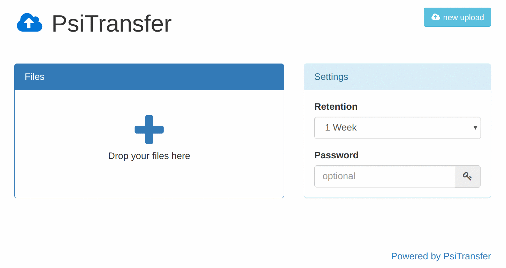

<!--
N.B.: This README was automatically generated by https://github.com/YunoHost/apps/tree/master/tools/README-generator
It shall NOT be edited by hand.
-->

# PSITransfer pour YunoHost

[](https://dash.yunohost.org/appci/app/psitransfer)  

[](https://install-app.yunohost.org/?app=psitransfer)

*[Read this readme in english.](./README.md)*

> *Ce package vous permet d’installer PSITransfer rapidement et simplement sur un serveur YunoHost.
Si vous n’avez pas YunoHost, regardez [ici](https://yunohost.org/#/install) pour savoir comment l’installer et en profiter.*

## Vue d’ensemble

Simple open source self-hosted file sharing solution.
It's an alternative to paid services like Dropbox, WeTransfer.

* No accounts, no logins
* Mobile friendly responsive interface
* Supports many and very big files (Streams ftw)
* Resumable up- and downloads ([tus.io](https://tus.io))
* Set an expire-time for your upload bucket
* One-time downloads
* Download all files as zip/tar.gz archive
* Modal-style file preview
* Requires Node >=7.4 or use `--harmony-async-await` flag
* Password protected download list ([AES](https://en.wikipedia.org/wiki/Advanced_Encryption_Standard))
* `/admin` Page lists bucket information, [Screenshot](https://raw.githubusercontent.com/psi-4ward/psitransfer/master/docs/PsiTransfer-Admin.png) (_disabled until you set `adminPass` config value_)
* Lightweight [Vue](https://vuejs.org) based frontend apps. Gzipped (on by default) less than 100k
* Explicit named bucket IDs with query param `sid=<myBucketID>`


**Version incluse :** 2.1.2~ynh1

## Captures d’écran



## Documentations et ressources

* Site officiel de l’app : <https://psi.cx/tags/PsiTransfer>
* Documentation officielle de l’admin : <https://github.com/psi-4ward/psitransfer/tree/master/docs>
* Dépôt de code officiel de l’app : <https://github.com/psi-4ward/psitransfer>
* Documentation YunoHost pour cette app : <https://yunohost.org/app_psitransfer>
* Signaler un bug : <https://github.com/YunoHost-Apps/psitransfer_ynh/issues>

## Informations pour les développeurs

Merci de faire vos pull request sur la [branche testing](https://github.com/YunoHost-Apps/psitransfer_ynh/tree/testing).

Pour essayer la branche testing, procédez comme suit.

``` bash
sudo yunohost app install https://github.com/YunoHost-Apps/psitransfer_ynh/tree/testing --debug
ou
sudo yunohost app upgrade psitransfer -u https://github.com/YunoHost-Apps/psitransfer_ynh/tree/testing --debug
```

**Plus d’infos sur le packaging d’applications :** <https://yunohost.org/packaging_apps>