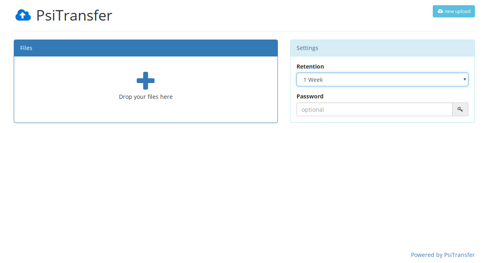

<!--
NOTA: Este README foi creado automáticamente por <https://github.com/YunoHost/apps/tree/master/tools/readme_generator>
NON debe editarse manualmente.
-->

# PsiTransfer para YunoHost

[](https://ci-apps.yunohost.org/ci/apps/psitransfer/)


[](https://install-app.yunohost.org/?app=psitransfer)

*[Le este README en outros idiomas.](./ALL_README.md)*

> *Este paquete permíteche instalar PsiTransfer de xeito rápido e doado nun servidor YunoHost.*  
> *Se non usas YunoHost, le a [documentación](https://yunohost.org/install) para saber como instalalo.*

## Vista xeral

Simple open source self-hosted file sharing solution. It's an alternative to paid services like Dropbox, WeTransfer.

### Features:

- Mobile friendly responsive interface
- Resumable up- and downloads ([tus.io](https://tus.io))
- Set an expire-time for your upload bucket
- Download all files as zip/tar.gz archive
- Password protected download list ([AES](https://en.wikipedia.org/wiki/Advanced_Encryption_Standard))
- `/admin` Page lists bucket information (_disabled until you set `adminPass` config value_)


**Versión proporcionada:** 2.2.0~ynh2

## Capturas de pantalla



## Documentación e recursos

- Web oficial da app: <https://psi.cx/tags/PsiTransfer>
- Documentación oficial para admin: <https://github.com/psi-4ward/psitransfer/tree/master/docs>
- Repositorio de orixe do código: <https://github.com/psi-4ward/psitransfer>
- Tenda YunoHost: <https://apps.yunohost.org/app/psitransfer>
- Informar dun problema: <https://github.com/YunoHost-Apps/psitransfer_ynh/issues>

## Info de desenvolvemento

Envía a túa colaboración á [rama `testing`](https://github.com/YunoHost-Apps/psitransfer_ynh/tree/testing).

Para probar a rama `testing`, procede deste xeito:

```bash
sudo yunohost app install https://github.com/YunoHost-Apps/psitransfer_ynh/tree/testing --debug
ou
sudo yunohost app upgrade psitransfer -u https://github.com/YunoHost-Apps/psitransfer_ynh/tree/testing --debug
```

**Máis info sobre o empaquetado da app:** <https://yunohost.org/packaging_apps>
