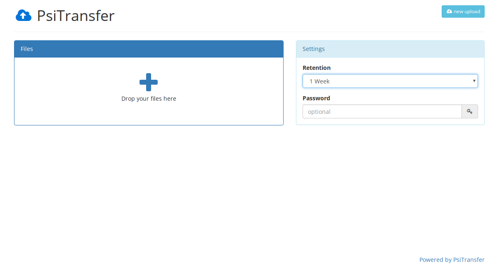

<!--
NB: Deze README is automatisch gegenereerd door <https://github.com/YunoHost/apps/tree/master/tools/readme_generator>
Hij mag NIET handmatig aangepast worden.
-->

# PsiTransfer voor Yunohost

[](https://ci-apps.yunohost.org/ci/apps/psitransfer/)


[](https://install-app.yunohost.org/?app=psitransfer)

*[Deze README in een andere taal lezen.](./ALL_README.md)*

> *Met dit pakket kun je PsiTransfer snel en eenvoudig op een YunoHost-server installeren.*  
> *Als je nog geen YunoHost hebt, lees dan [de installatiehandleiding](https://yunohost.org/install), om te zien hoe je 'm installeert.*

## Overzicht

Simple open source self-hosted file sharing solution. It's an alternative to paid services like Dropbox, WeTransfer.

### Features:

- Mobile friendly responsive interface
- Resumable up- and downloads ([tus.io](https://tus.io))
- Set an expire-time for your upload bucket
- Download all files as zip/tar.gz archive
- Password protected download list ([AES](https://en.wikipedia.org/wiki/Advanced_Encryption_Standard))
- `/admin` Page lists bucket information (_disabled until you set `adminPass` config value_)


**Geleverde versie:** 2.2.0~ynh2

## Schermafdrukken



## Documentatie en bronnen

- Officiele website van de app: <https://psi.cx/tags/PsiTransfer>
- Officiele beheerdersdocumentatie: <https://github.com/psi-4ward/psitransfer/tree/master/docs>
- Upstream app codedepot: <https://github.com/psi-4ward/psitransfer>
- YunoHost-store: <https://apps.yunohost.org/app/psitransfer>
- Meld een bug: <https://github.com/YunoHost-Apps/psitransfer_ynh/issues>

## Ontwikkelaarsinformatie

Stuur je pull request alsjeblieft naar de [`testing`-branch](https://github.com/YunoHost-Apps/psitransfer_ynh/tree/testing).

Om de `testing`-branch uit te proberen, ga als volgt te werk:

```bash
sudo yunohost app install https://github.com/YunoHost-Apps/psitransfer_ynh/tree/testing --debug
of
sudo yunohost app upgrade psitransfer -u https://github.com/YunoHost-Apps/psitransfer_ynh/tree/testing --debug
```

**Verdere informatie over app-packaging:** <https://yunohost.org/packaging_apps>
